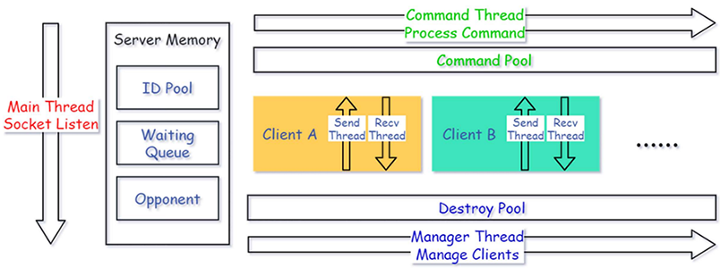
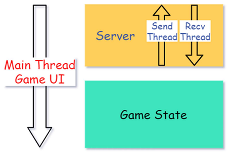
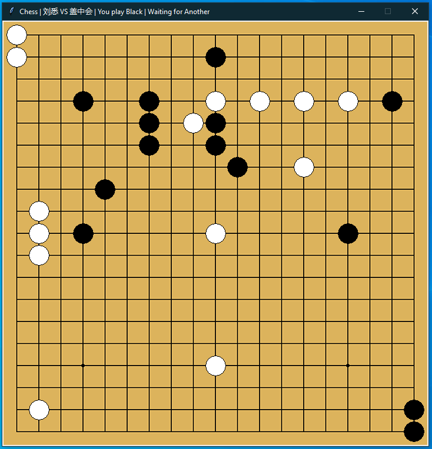

# OnlineChess
> An Online Chess Game by Python  
> [多人游戏服务器的设计](readMe/Chess.pdf)
---

> This is my Final Project of Course *Modern communication network technology*

## Layout

### Server

### Client

## Running

